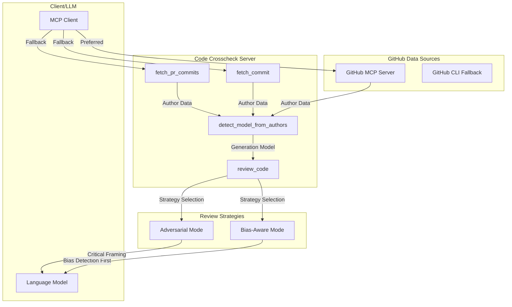

# MCP Code Crosscheck

🚧 **UNDER CONSTRUCTION** 🚧

A POC MCP (Model Context Protocol) server that attempts to reduce known biases in AI code review through cross-model evaluation and bias-aware prompting strategies, based on recent research documenting systematic evaluation biases in language models.

## Overview

This server implements an experimental approach to reduce known biases in AI code review through two complementary strategies:

1. **Cross-model evaluation**: Requests different models for generation vs. review to avoid self-preference bias
2. **Bias-aware prompting**: Explicitly instructs models to ignore common bias triggers identified in recent research

**Important Limitations**: Research has shown that all major LLMs share similar vulnerabilities to code evaluation biases (Moon et al., 2025). While this server attempts to mitigate these biases, it cannot eliminate them entirely. Both cross-model evaluation and bias-aware prompting provide incremental improvements but are not complete solutions.

**Approach**: The server offers two review modes:
- **Default (`bias_aware`)**: Attempts to reduce false positives from style and comment biases
- **Opt-in (`adversarial`)**: Provides thorough review but may introduce its own biases

This tool should be used as one component in a comprehensive review process that includes static analysis, testing, and human judgment.

## Research Context

#### Self-Recognition and Self-Preference
- **[LLM Evaluators Recognize and Favor Their Own Generations](https://arxiv.org/abs/2404.13076)** (Panickssery et al., UC San Diego, April 2024)
  - Found evidence of self-recognition leading to self-preference bias in controlled settings
  - Models showed tendency to rate their own outputs higher when identifiable
  - Discovered linear correlation between self-recognition capability and bias strength

#### Self-Bias Across Different Models
- **[Pride and Prejudice: LLM Amplifies Self-Bias in Self-Refinement](https://arxiv.org/abs/2402.11436)** (Xu et al., February 2024)
  - Observed self-bias patterns in 6 major LLMs in specific evaluation tasks
  - Suggests self-refinement may amplify rather than reduce bias in some contexts

#### Code-Specific Evaluation Bias
- **[Don't Judge Code by Its Cover: Exploring Biases in LLM Judges for Code Evaluation](https://arxiv.org/abs/2505.16222)** (Moon et al., May 2025)
  - First comprehensive study of LLM bias specifically in code evaluation
  - Identified 6 distinct bias types affecting all tested models
  - Found biases persist even with test-case generation strategies
  - Demonstrates that cross-model evaluation has limited effectiveness due to shared biases

#### Quantifying LLM-as-Judge Biases
- **[Justice or Prejudice? Quantifying Biases in LLM-as-a-Judge](https://arxiv.org/abs/2410.02736)** (Li et al., October 2024)
  - Comprehensive benchmark showing 40% average bias rate across models
  - Demonstrates effectiveness of multi-model evaluation approaches
  - Provides quantitative evidence for bias reduction through model diversity

- **[Self-Preference Bias in LLM-as-a-Judge](https://arxiv.org/abs/2410.21819)** (Wu et al., October 2024)
  - Shows 50%+ of evaluations exhibit favorable bias toward own outputs
  - Demonstrates bias persistence even with anonymized sources
  - Supports using different models for generation vs evaluation

#### Multi-Agent Code Generation Success
- **[MapCoder: Multi-Agent Code Generation for Competitive Problem Solving](https://aclanthology.org/2024.acl-long.269/)** (Islam et al., ACL 2024)
  - Achieved 93.9% pass@1 on HumanEval using separated agents
  - Demonstrates effectiveness of role separation in reducing bias
  - Validates multi-agent architecture for code tasks

#### Self-Recognition Mechanisms
- **[Self-Recognition in Language Models](https://arxiv.org/abs/2407.06946)** (Wataoka et al., July 2024)
  - Explains "familiarity hypothesis": models prefer outputs matching their training patterns
  - Shows models evaluate based on perplexity alignment
  - Provides theoretical foundation for cross-model evaluation

## Features

### Tools

- **`review_code`**: Review code with bias mitigation strategies. While cross-model evaluation is attempted, research shows all models share similar biases. The 'bias_aware' mode explicitly attempts to ignore known bias triggers but cannot guarantee complete bias elimination. The 'adversarial' mode may introduce its own biases through critical framing.
- **`detect_model_from_authors`**: Detect AI model from commit author information. Use this with data from GitHub sources.
- **`fetch_commit`**: Fetch commit details using GitHub CLI. Fallback tool - prefer GitHub MCP server if available.
- **`fetch_pr_commits`**: Fetch PR commits using GitHub CLI. Fallback tool - prefer GitHub MCP server if available.

### Prompts

- **`code_review`**: Comprehensive code review covering security, performance, and maintainability with structured checklist output

## How It Works

### Simple Two-Mode Design

The server uses a streamlined approach with two review strategies:

#### Default Mode: `bias_aware`
- **Focus**: Attempts to ignore known bias triggers before evaluation
- **Approach**: Explicitly identifies and lists potential biases, then evaluates while ignoring them
- **Effectiveness**: Provides modest improvement but cannot eliminate all bias influence
- **Best for**: Regular code reviews where reduced bias is desired

#### Opt-in Mode: `adversarial`
- **Focus**: Thorough "paranoid security reviewer" approach
- **Approach**: Uses competitive framing to encourage finding issues
- **Trade-off**: May introduce its own biases through over-critical framing
- **Best for**: Security-critical code where false positives are acceptable

#### When to Use Which

**Use default (bias_aware) for:**
- Normal development workflow
- Reducing influence of style and comment biases
- General correctness evaluation
- Most code reviews

**Explicitly request adversarial when:**
- Security-critical code paths
- Pre-production final checks
- You prefer thorough review over false positive avoidance
- Complementing other review approaches

### Modular Architecture

This server uses a modular design that allows seamless integration with GitHub MCP servers when available, while providing fallback functionality through GitHub CLI.

### Model Detection Strategy

The server detects AI models from commit co-authors:
- Parses `Co-Authored-By:` trailers in commit messages
- Recognizes patterns like `Co-Authored-By: Claude <noreply@anthropic.com>`
- Supports Claude, GPT/OpenAI, GitHub Copilot, Gemini, and other AI tools

### Cross-Model Review Process

1. **Model Exclusion**: The server tracks which model generated the code and attempts to request a different model family for review
2. **Client Sampling**: Uses MCP's sampling feature to request the client use a different model (success depends on client capabilities)
3. **Manual Fallback**: When sampling isn't supported, the tool provides ready-to-use prompts and specific model recommendations
4. **Structured Output**: Returns consistent review format with severity levels, metrics, and alternatives
5. **Strategy Indication**: Clear labeling of which review strategy was used and any caveats

**Note on Effectiveness**: While cross-model review can help with self-preference bias, research shows all models share similar evaluation biases related to code style, comments, and structure.

## Known Limitations

Based on current research on LLM code evaluation biases:

### Fundamental Limitations

1. **Shared Model Biases**: Research shows all major LLMs exhibit similar biases when evaluating code, including:
   - Favoring code with "expert" attribution comments
   - Rating code higher when it has longer variable names
   - Being misled by incorrect task descriptions in comments
   - Perceiving unused functions as signs of sophistication

2. **Incomplete Mitigation**: While bias-aware prompting helps, models may still:
   - Fail to detect all bias triggers
   - Be influenced by biases even when instructed to ignore them
   - Introduce new biases through the review framing itself

3. **No Code Preprocessing**: The server doesn't strip problematic elements before evaluation, which research suggests could improve results.

### Practical Implications

- **Cross-model review** may simply exchange one model's biases for another's
- **Bias-aware mode** reduces but doesn't eliminate bias influence  
- **Adversarial mode** may introduce false positives through over-critical framing
- Results should be validated through complementary approaches (static analysis, tests, human review)

### Recommended Usage

Use this server as part of a defense-in-depth strategy:
1. Run static analysis tools first (they don't have these biases)
2. Use bias-aware mode for general correctness checking
3. Apply adversarial mode selectively for critical code

### What This Tool Can Do

Despite limitations, the server can help with:
- Identifying logical errors and edge cases
- Catching security vulnerabilities (though with possible false positives)
- Providing structured review output
- Offering different perspectives through mode selection

### What This Tool Cannot Do

- Completely eliminate LLM evaluation biases
- Guarantee that cross-model review avoids shared biases
- Replace static analysis
- Substitute for comprehensive testing
- Provide definitive correctness validation

## Installation

```bash
# Clone the repository
git clone <repository-url>
cd mcp-code-crosscheck

# Install dependencies
npm install

# Build the project
npm run build
```

## Usage

### As an MCP Server

Add to your MCP client configuration:

```json
{
  "mcpServers": {
    "code-crosscheck": {
      "command": "node",
      "args": ["path/to/mcp-code-crosscheck/dist/index.js"],
      "env": {}
    }
  }
}
```

### Tool Usage

#### Modular Workflow Examples

**Preferred Workflow (with GitHub MCP server):**
```javascript
// 1. Use GitHub MCP server to fetch commit data
{
  "method": "tools/call",
  "params": {
    "name": "github_get_commit", // GitHub MCP server tool
    "arguments": {
      "owner": "modelcontextprotocol",
      "repo": "inspector", 
      "commit_sha": "fdae89ecbfec8fda5d166277ab77398e6d3c06c9"
    }
  }
}

// 2. Use this server to detect AI model from authors
{
  "method": "tools/call",
  "params": {
    "name": "detect_model_from_authors",
    "arguments": {
      "authors": [/* author data from step 1 */]
    }
  }
}

// 3. Use this server for bias-aware review (default)
{
  "method": "tools/call",
  "params": {
    "name": "review_code",
    "arguments": {
      "code": "def process_user_input(data):\n    return eval(data)",
      "generationModel": "claude",
      "language": "python",
      "context": "User input processing function"
    }
  }
}
```

#### Individual Tool Reference

**review_code**
- `code` (required): The code to review
- `generationModel` (required): Model that generated the code
- `language` (optional): Programming language
- `context` (optional): Additional context about the code
- `reviewType` (optional): security, performance, maintainability, general
- `reviewStrategy` (optional): `bias_aware` (default) or `adversarial`

**Usage Examples:**

```javascript
// Normal review (uses bias_aware by default)
{
  "name": "review_code",
  "arguments": {
    "code": "function processPayment(amount) { ... }",
    "generationModel": "claude",
    "language": "javascript"
  }
}

// Thorough review (explicit adversarial mode)
{
  "name": "review_code",
  "arguments": {
    "code": "function processPayment(amount) { ... }",
    "generationModel": "claude",
    "language": "javascript",
    "reviewStrategy": "adversarial"
  }
}
```

**Output Format:**
- Structured markdown with clear sections for summary, issues, metrics, and alternatives
- Quantitative ratings (1-3 scale) for error handling, performance, security, maintainability
- Metadata showing review model, generation model, and strategy used
- Strategy indicator: "✓ Bias-aware review completed" or "⚠️ Adversarial review completed - Some findings may be overly critical"
- For bias-aware strategy: explicit list of detected bias triggers


## Architecture

### Modular Design



## Contributing

This is an experimental POC exploring bias mitigation in LLM code review. Contributions are welcome, particularly:

- Additional bias detection strategies
- Code preprocessing approaches
- Integration with static analysis tools
- Empirical testing of bias reduction effectiveness

## Related

- [Model Context Protocol](https://modelcontextprotocol.io/)
- [MCP TypeScript SDK](https://github.com/modelcontextprotocol/typescript-sdk)
