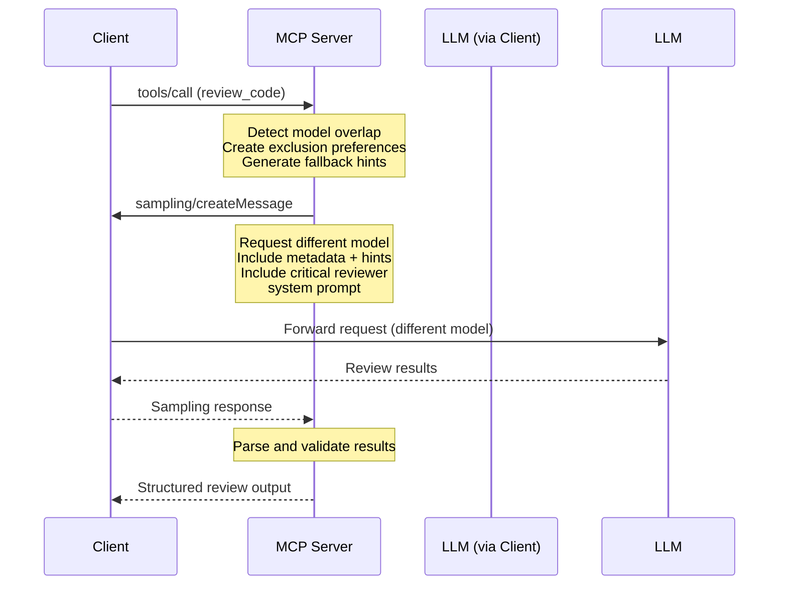

# MCP Code Crosscheck

An MCP (Model Context Protocol) server that attempts to reduce bias in AI code review by requesting different models for code generation and review, based on recent research suggesting self-evaluation bias in language models.

## Overview

This server implements an experimental approach based on the hypothesis that when the same model generates and evaluates code, it may exhibit self-preference bias, potentially leading to blind spots in code quality assessment.

**Approach**: Cross-model code review - when code is generated by one model, request a different model family for review. The effectiveness of this approach is still being studied, and results may vary depending on the specific models and code being reviewed.

## Research Context

Recent studies suggest potential bias in AI self-evaluation, though the practical implications for code review are still being explored:

### Self-Recognition and Self-Preference
- **[LLM Evaluators Recognize and Favor Their Own Generations](https://arxiv.org/abs/2404.13076)** (Panickssery et al., UC San Diego, April 2024)
  - Found evidence of self-recognition leading to self-preference bias in controlled settings
  - Models showed tendency to rate their own outputs higher when identifiable
  - Discovered linear correlation between self-recognition capability and bias strength

### Self-Bias Across Different Models
- **[Pride and Prejudice: LLM Amplifies Self-Bias in Self-Refinement](https://arxiv.org/abs/2402.11436)** (Xu et al., February 2024)
  - Observed self-bias patterns in 6 major LLMs in specific evaluation tasks
  - Suggests self-refinement may amplify rather than reduce bias in some contexts

### Code-Specific Evaluation Bias
- **[Don't Judge Code by Its Cover: Exploring Biases in LLM Judges for Code Evaluation](https://arxiv.org/abs/2505.16222)** (Moon et al., May 2025)
  - First comprehensive study of LLM bias specifically in code evaluation
  - Identified 6 distinct bias types: formatting, naming, comments, language-specific patterns
  - Found biases persist even with test-case generation strategies
  - Validates need for cross-model evaluation in code review contexts

### Quantifying LLM-as-Judge Biases
- **[Justice or Prejudice? Quantifying Biases in LLM-as-a-Judge](https://arxiv.org/abs/2410.02736)** (Li et al., October 2024)
  - Comprehensive benchmark showing 40% average bias rate across models
  - Demonstrates effectiveness of multi-model evaluation approaches
  - Provides quantitative evidence for bias reduction through model diversity

- **[Self-Preference Bias in LLM-as-a-Judge](https://arxiv.org/abs/2410.21819)** (Wu et al., October 2024)
  - Shows 50%+ of evaluations exhibit favorable bias toward own outputs
  - Demonstrates bias persistence even with anonymized sources
  - Supports using different models for generation vs evaluation

### Multi-Agent Code Generation Success
- **[MapCoder: Multi-Agent Code Generation for Competitive Problem Solving](https://aclanthology.org/2024.acl-long.269/)** (Islam et al., ACL 2024)
  - Achieved 93.9% pass@1 on HumanEval using separated agents
  - Demonstrates effectiveness of role separation in reducing bias
  - Validates multi-agent architecture for code tasks

### Self-Recognition Mechanisms
- **[Self-Recognition in Language Models](https://arxiv.org/abs/2407.06946)** (Wataoka et al., July 2024)
  - Explains "familiarity hypothesis": models prefer outputs matching their training patterns
  - Shows models evaluate based on perplexity alignment
  - Provides theoretical foundation for cross-model evaluation

### Structured Prompting Effects
- **[Principled Instructions Are All You Need](https://arxiv.org/abs/2312.16171)** (VILA Lab, December 2023)
  - Tested prompting approaches across different models and tasks
  - Found structured instructions can improve performance, though results vary by task
  - Emotional framing showed modest improvements in some scenarios

### Multi-Agent Evaluation
- **[Two Tales of Persona in LLMs](https://arxiv.org/html/2406.01171v1)** (June 2024)
  - Explored role-based prompting in multi-agent systems
  - Suggests adversarial personas may improve evaluation in certain contexts

**Note**: While these studies provide motivation for cross-model evaluation, their applicability to code review specifically has not been extensively validated. The effectiveness of this approach may vary significantly based on the models used, code complexity, and review criteria.

## Features

### Tools

- **`review_code`**: Review code with bias mitigation using cross-model evaluation. Can auto-detect generation model from commit co-authors or use provided parameter.
- **`review_commit`**: Review a specific commit by fetching its changes and auto-detecting the generation model from co-authors.
- **`review_pr`**: Review all commits in a pull request and auto-detect the generation model from co-authors.

### Resources

- **Review Templates**: System prompts for different review types:
  - `review://templates/security` - Security-focused reviews
  - `review://templates/performance` - Performance-focused reviews  
  - `review://templates/maintainability` - Maintainability-focused reviews
  - `review://templates/general` - General code reviews

### Prompts

- **`quick_security_review`**: Manual security review prompt
- **`performance_review`**: Manual performance review prompt
- **`maintainability_review`**: Manual maintainability review prompt

## How It Works

### Model Detection Strategy

The server uses a two-step approach to detect the generation model:

1. **Git Co-author Detection** (Primary): Automatically detects AI models from commit co-authors
   - Parses `Co-Authored-By:` trailers in commit messages
   - Recognizes patterns like `Co-Authored-By: Claude <noreply@anthropic.com>`
   - Supports Claude, GPT/OpenAI, GitHub Copilot, Gemini, and other AI tools
   - Uses GitHub CLI to fetch commit and PR information

2. **Parameter Fallback** (Secondary): Uses the provided `generationModel` parameter if no co-author detected

### Cross-Model Review Process

1. **Model Exclusion**: The server tracks which model generated the code and attempts to request a different model family for review
2. **Client Sampling**: Uses MCP's sampling feature to request the client use a different model (success depends on client capabilities)
3. **Structured Output**: Returns consistent review format with severity levels, metrics, and alternatives
4. **Flexible Model Selection**: Uses metadata and hints to guide client model choice, though actual model selection depends on client implementation

### GitHub CLI Integration

The server integrates with GitHub CLI (`gh`) to:
- Fetch commit details and co-author information
- Retrieve PR commits and detect consistent model usage across the PR
- Support both public and private repositories (with appropriate permissions)
- Work with any GitHub repository when provided in `owner/repo` format

## Installation

```bash
# Clone the repository
git clone <repository-url>
cd mcp-code-crosscheck

# Install dependencies
npm install

# Build the project
npm run build
```

## Usage

### As an MCP Server

Add to your MCP client configuration:

```json
{
  "mcpServers": {
    "code-crosscheck": {
      "command": "node",
      "args": ["path/to/mcp-code-crosscheck/dist/index.js"],
      "env": {}
    }
  }
}
```

### Tool Usage

#### Review Code Tool

```javascript
// Example tool call with auto-detection from commit
{
  "method": "tools/call",
  "params": {
    "name": "review_code",
    "arguments": {
      "code": "def process_user_input(data):\n    return eval(data)",
      "commitHash": "fdae89ecbfec8fda5d166277ab77398e6d3c06c9",
      "repo": "modelcontextprotocol/inspector",
      "language": "python",
      "context": "User input processing function"
    }
  }
}

// Example tool call with manual model specification
{
  "method": "tools/call",
  "params": {
    "name": "review_code",
    "arguments": {
      "code": "def process_user_input(data):\n    return eval(data)",
      "generationModel": "claude",
      "language": "python",
      "context": "User input processing function"
    }
  }
}
```

**Input Parameters:**
- `code` (required): The code to review
- `generationModel` (optional): Model that generated the code (optional if commitHash or prNumber provided)
- `language` (optional): Programming language
- `context` (optional): Additional context about the code
- `commitHash` (optional): Git commit hash to detect generation model from co-authors
- `prNumber` (optional): GitHub PR number to detect generation model from co-authors
- `repo` (optional): GitHub repository (owner/repo format, defaults to current repo)

#### Review Commit Tool

```javascript
// Example tool call
{
  "method": "tools/call",
  "params": {
    "name": "review_commit",
    "arguments": {
      "commitHash": "fdae89ecbfec8fda5d166277ab77398e6d3c06c9",
      "repo": "modelcontextprotocol/inspector",
      "reviewType": "security"
    }
  }
}
```

**Input Parameters:**
- `commitHash` (required): Git commit hash to review
- `repo` (optional): GitHub repository (owner/repo format, defaults to current repo)
- `generationModel` (optional): Model that generated the code (fallback if not detected from co-authors)
- `reviewType` (optional): Type of review to perform (security, performance, maintainability, general)

#### Review PR Tool

```javascript
// Example tool call
{
  "method": "tools/call",
  "params": {
    "name": "review_pr",
    "arguments": {
      "prNumber": "509",
      "repo": "modelcontextprotocol/inspector",
      "reviewType": "general"
    }
  }
}
```

**Input Parameters:**
- `prNumber` (required): GitHub PR number to review
- `repo` (optional): GitHub repository (owner/repo format, defaults to current repo)
- `generationModel` (optional): Model that generated the code (fallback if not detected from co-authors)
- `reviewType` (optional): Type of review to perform (security, performance, maintainability, general)

**Output (All Tools):**
- `reviewModel`: Model used for review
- `summary`: Brief overall assessment
- `issues`: Array of identified issues with severity and suggestions
- `metrics`: Quantitative ratings (1-5) for error handling, performance, security, maintainability
- `alternative`: Alternative implementation approach

### Prompt Usage

Use the provided prompts for manual code reviews:

```javascript
// Quick security review
{
  "method": "prompts/get",
  "params": {
    "name": "quick_security_review",
    "arguments": {
      "code": "your code here"
    }
  }
}
```

## Limitations and Considerations

### When This Approach May Not Help
- **Simple code**: For straightforward implementations, cross-model review may add complexity without benefit
- **Domain-specific code**: Models may lack specialized knowledge regardless of which one reviews
- **Subjective preferences**: Style and architectural decisions may vary between models without clear "better" choices

**Recommendation**: Consider this as one tool among many for code review, not a replacement for human judgment or comprehensive testing.

## Architecture



## Related

- [Model Context Protocol](https://modelcontextprotocol.io/)
- [MCP TypeScript SDK](https://github.com/modelcontextprotocol/typescript-sdk)
