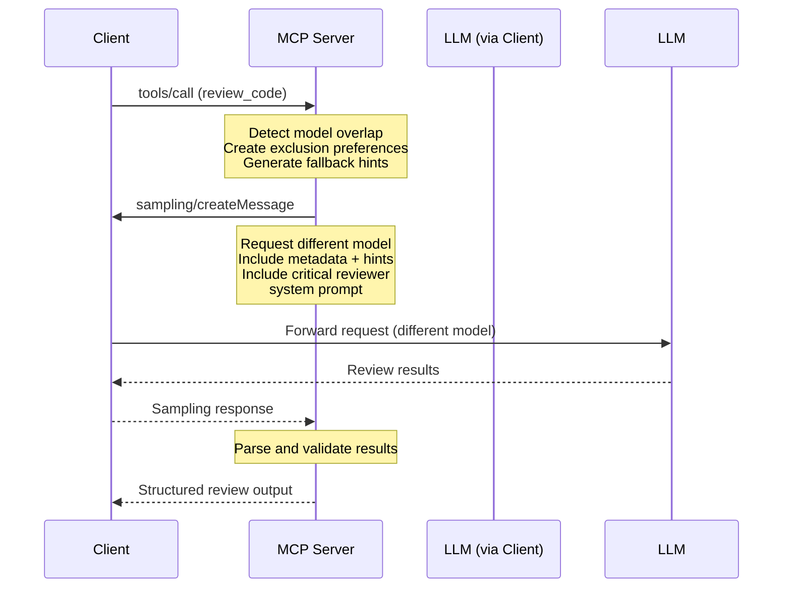

# MCP Code Crosscheck

An MCP (Model Context Protocol) server that attempts to reduce bias in AI code review by requesting different models for code generation and review, based on recent research suggesting self-evaluation bias in language models.

## Overview

This server implements an experimental approach based on the hypothesis that when the same model generates and evaluates code, it may exhibit self-preference bias, potentially leading to blind spots in code quality assessment.

**Approach**: Cross-model code review - when code is generated by one model, request a different model family for review. The effectiveness of this approach is still being studied, and results may vary depending on the specific models and code being reviewed.

## Research Context

Recent studies suggest potential bias in AI self-evaluation, though the practical implications for code review are still being explored:

### Self-Recognition and Self-Preference
- **[LLM Evaluators Recognize and Favor Their Own Generations](https://arxiv.org/abs/2404.13076)** (Panickssery et al., UC San Diego, April 2024)
  - Found evidence of self-recognition leading to self-preference bias in controlled settings
  - Models showed tendency to rate their own outputs higher when identifiable
  - Discovered linear correlation between self-recognition capability and bias strength

### Self-Bias Across Different Models
- **[Pride and Prejudice: LLM Amplifies Self-Bias in Self-Refinement](https://arxiv.org/abs/2402.11436)** (Xu et al., February 2024)
  - Observed self-bias patterns in 6 major LLMs in specific evaluation tasks
  - Suggests self-refinement may amplify rather than reduce bias in some contexts

### Code-Specific Evaluation Bias
- **[Don't Judge Code by Its Cover: Exploring Biases in LLM Judges for Code Evaluation](https://arxiv.org/abs/2505.16222)** (Moon et al., May 2025)
  - First comprehensive study of LLM bias specifically in code evaluation
  - Identified 6 distinct bias types: formatting, naming, comments, language-specific patterns
  - Found biases persist even with test-case generation strategies
  - Validates need for cross-model evaluation in code review contexts

### Quantifying LLM-as-Judge Biases
- **[Justice or Prejudice? Quantifying Biases in LLM-as-a-Judge](https://arxiv.org/abs/2410.02736)** (Li et al., October 2024)
  - Comprehensive benchmark showing 40% average bias rate across models
  - Demonstrates effectiveness of multi-model evaluation approaches
  - Provides quantitative evidence for bias reduction through model diversity

- **[Self-Preference Bias in LLM-as-a-Judge](https://arxiv.org/abs/2410.21819)** (Wu et al., October 2024)
  - Shows 50%+ of evaluations exhibit favorable bias toward own outputs
  - Demonstrates bias persistence even with anonymized sources
  - Supports using different models for generation vs evaluation

### Multi-Agent Code Generation Success
- **[MapCoder: Multi-Agent Code Generation for Competitive Problem Solving](https://aclanthology.org/2024.acl-long.269/)** (Islam et al., ACL 2024)
  - Achieved 93.9% pass@1 on HumanEval using separated agents
  - Demonstrates effectiveness of role separation in reducing bias
  - Validates multi-agent architecture for code tasks

### Self-Recognition Mechanisms
- **[Self-Recognition in Language Models](https://arxiv.org/abs/2407.06946)** (Wataoka et al., July 2024)
  - Explains "familiarity hypothesis": models prefer outputs matching their training patterns
  - Shows models evaluate based on perplexity alignment
  - Provides theoretical foundation for cross-model evaluation

### Structured Prompting Effects
- **[Principled Instructions Are All You Need](https://arxiv.org/abs/2312.16171)** (VILA Lab, December 2023)
  - Tested prompting approaches across different models and tasks
  - Found structured instructions can improve performance, though results vary by task
  - Emotional framing showed modest improvements in some scenarios

### Multi-Agent Evaluation
- **[Two Tales of Persona in LLMs](https://arxiv.org/html/2406.01171v1)** (June 2024)
  - Explored role-based prompting in multi-agent systems
  - Suggests adversarial personas may improve evaluation in certain contexts

**Note**: While these studies provide motivation for cross-model evaluation, their applicability to code review specifically has not been extensively validated. The effectiveness of this approach may vary significantly based on the models used, code complexity, and review criteria.

## Features

### Tools

- **`review_code`**: Attempts cross-model code review by requesting the client use a different model than the one that generated the code

### Resources

- **Review Templates**: System prompts for different review types:
  - `review://templates/security` - Security-focused reviews
  - `review://templates/performance` - Performance-focused reviews  
  - `review://templates/maintainability` - Maintainability-focused reviews
  - `review://templates/general` - General code reviews

### Prompts

- **`quick_security_review`**: Manual security review prompt
- **`performance_review`**: Manual performance review prompt
- **`maintainability_review`**: Manual maintainability review prompt

## How It Works

1. **Model Exclusion**: The server tracks which model generated the code and attempts to request a different model family for review
2. **Client Sampling**: Uses MCP's sampling feature to request the client use a different model (success depends on client capabilities)
3. **Structured Output**: Returns consistent review format with severity levels, metrics, and alternatives
4. **Flexible Model Selection**: Uses metadata and hints to guide client model choice, though actual model selection depends on client implementation

## Installation

```bash
# Clone the repository
git clone <repository-url>
cd mcp-code-crosscheck

# Install dependencies
npm install

# Build the project
npm run build
```

## Usage

### As an MCP Server

Add to your MCP client configuration:

```json
{
  "mcpServers": {
    "code-crosscheck": {
      "command": "node",
      "args": ["path/to/mcp-code-crosscheck/dist/index.js"],
      "env": {}
    }
  }
}
```

### Tool Usage

#### Review Code Tool

```javascript
// Example tool call
{
  "method": "tools/call",
  "params": {
    "name": "review_code",
    "arguments": {
      "code": "def process_user_input(data):\n    return eval(data)",
      "generationModel": "gpt-4.1",
      "language": "python",
      "context": "User input processing function"
    }
  }
}
```

**Input Parameters:**
- `code` (required): The code to review
- `generationModel` (required): Model that generated the code
- `language` (optional): Programming language
- `context` (optional): Additional context about the code

**Output:**
- `reviewModel`: Model used for review
- `summary`: Brief overall assessment
- `issues`: Array of identified issues with severity and suggestions
- `metrics`: Quantitative ratings (1-5) for error handling, performance, security, maintainability
- `alternative`: Alternative implementation approach

### Prompt Usage

Use the provided prompts for manual code reviews:

```javascript
// Quick security review
{
  "method": "prompts/get",
  "params": {
    "name": "quick_security_review",
    "arguments": {
      "code": "your code here"
    }
  }
}
```

## Limitations and Considerations

This experimental approach has several important limitations:

### Effectiveness Uncertainty
- **Unproven in practice**: While research suggests self-bias exists, the practical benefit of cross-model review for code quality is not established
- **Variable results**: Effectiveness likely depends on specific model combinations, code complexity, and review criteria
- **No guarantee of improvement**: Different models may simply have different biases rather than providing objectively better reviews

### Technical Limitations
- **Increased latency**: Requires additional API calls and model switching
- **Higher costs**: Uses more computational resources than single-model review
- **Client dependency**: Relies on MCP client supporting model selection and sampling
- **Model availability**: Limited by which models the client has access to

### Scope Limitations
- **Pattern matching**: Model family detection is based on naming patterns and may misclassify models
- **Context loss**: Different models may lack context about the original code generation process
- **Inconsistent standards**: Different models may apply different coding standards or preferences

### When This Approach May Not Help
- **Simple code**: For straightforward implementations, cross-model review may add complexity without benefit
- **Domain-specific code**: Models may lack specialized knowledge regardless of which one reviews
- **Subjective preferences**: Style and architectural decisions may vary between models without clear "better" choices

**Recommendation**: Consider this as one tool among many for code review, not a replacement for human judgment or comprehensive testing.

## Model Selection Strategy

The server implements a regex-based overlap detection system to attempt diverse model selection:

### Three-Tier Detection System

1. **Base Model Detection**: Uses regex patterns to identify core model families
   - Pattern: `/^(gpt|claude|gemini|llama|mistral|phi|codestral|deepseek|qwen)/i`
   - Examples: "gpt-4-turbo" and "gpt-3.5" both match "gpt"

2. **Provider Detection**: Identifies models from the same company/provider
   - Pattern: `/(openai|anthropic|google|meta|microsoft|mistral|deepseek|alibaba)/i`
   - Prevents using multiple models from the same provider

3. **Significant Substring Matching**: Finds shared meaningful text patterns
   - Matches substrings of 4+ characters to catch edge cases
   - Ensures comprehensive overlap detection

### Client Guidance Strategy

- **Primary Method**: Metadata with `excludeModel` and `excludeFamily` for smart clients
- **Fallback Method**: Hints array with broad model suggestions for simpler clients
- **Dual Approach**: Both methods included in every request for maximum compatibility

### Overlap Detection Examples

**Models that WILL be excluded (overlapping):**
- `gpt-4` ↔ `gpt-3.5-turbo` (same base: "gpt")
- `claude-3-sonnet` ↔ `claude-3-haiku` (same base: "claude")
- `gemini-1.5-pro` ↔ `gemini-1.0-pro` (same base: "gemini")
- `gpt-4-turbo` ↔ `gpt-4o` (same base: "gpt")

**Models that will NOT be excluded (diverse):**
- `gpt-4` ↔ `claude-3-sonnet` (different bases: "gpt" vs "claude")
- `claude-3-haiku` ↔ `gemini-1.5-pro` (different bases: "claude" vs "gemini")
- `llama-2-70b` ↔ `gpt-4` (different bases: "llama" vs "gpt")

### Supported Model Patterns

- **OpenAI**: gpt, gpt-3, gpt-4, gpt-4o, etc.
- **Anthropic**: claude, claude-3, claude-3-sonnet, etc.
- **Google**: gemini, gemini-1.5, gemini-pro, etc.
- **Meta**: llama, llama-2, llama-3, etc.
- **Mistral**: mistral, codestral, etc.
- **Others**: phi, deepseek, qwen, and more

## Architecture



## Development

### Scripts

- `npm run build` - Compile TypeScript
- `npm run dev` - Watch mode compilation
- `npm start` - Run the server

### Project Structure

```
src/
├── index.ts          # Main entry point (STDIO transport)
├── server.ts         # Core MCP server implementation
├── types.ts          # TypeScript type definitions
└── utils.ts          # Utility functions for model selection and prompts
```

## Related

- [Model Context Protocol](https://modelcontextprotocol.io/)
- [MCP TypeScript SDK](https://github.com/modelcontextprotocol/typescript-sdk)
