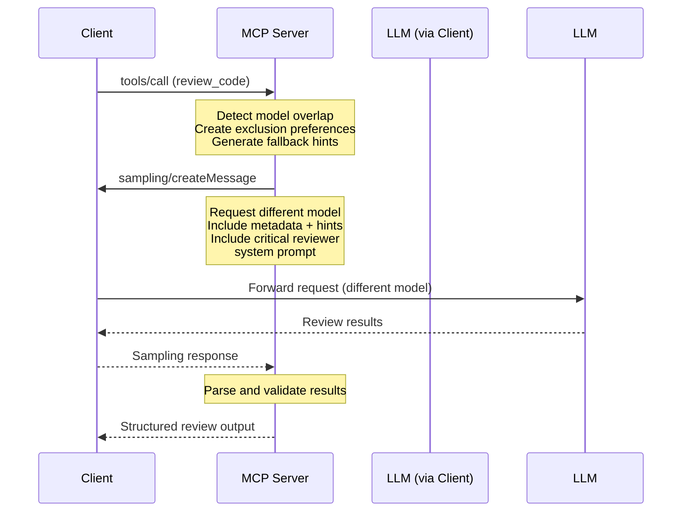

# MCP Code Crosscheck

An MCP (Model Context Protocol) server that provides bias-resistant AI code review by requesting sampling from the client with carefully crafted review prompts, ensuring cross-model evaluation.

## Overview

This server addresses the hypothesis that as more code is being generated AND evaluated by the same model, the risk of bias towards that model's preferences will grow, leading to blind spots in code quality and lower diversity of approaches/implementations over time.

The solution: **Cross-Model Code Review** - ensuring that code generated by one model is reviewed by a different model to minimize bias and improve review quality.

## Research Backing

This approach is supported by recent research demonstrating significant bias in AI self-evaluation:

### Self-Recognition Drives Self-Preference
- **[LLM Evaluators Recognize and Favor Their Own Generations](https://arxiv.org/abs/2404.13076)** (Panickssery et al., UC San Diego, April 2024)
  - Demonstrated causal link between self-recognition and self-preference bias
  - Models consistently rate their own outputs higher when they can identify them

### Universal Self-Bias Across Models
- **[Pride and Prejudice: LLM Amplifies Self-Bias in Self-Refinement](https://arxiv.org/abs/2402.11436)** (Xu et al., February 2024)
  - Found self-bias in all 6 major LLMs tested (GPT-4, Gemini, Mixtral, etc.)
  - Self-refinement actually amplifies bias rather than reducing it

### Effectiveness of Structured Evaluation
- **[Principled Instructions Are All You Need](https://arxiv.org/abs/2312.16171)** (VILA Lab, December 2023)
  - Tested 26 prompting principles across GPT-3.5/4 and Llama
  - Structured, numbered instructions improved performance by up to 50%
  - Emotional stimuli ("This is critical...") showed 10-15% improvement

### Multi-Agent and Adversarial Approaches
- **[Two Tales of Persona in LLMs](https://arxiv.org/html/2406.01171v1)** (June 2024)
  - Adversarial personas in multi-agent systems improve critical evaluation
  - Role-based prompting enhances task-specific performance

**Key Insight**: Cross-model evaluation eliminates self-recognition bias while structured, adversarial prompting maximizes critical analysis quality.

## Features

### 🔧 Tools

- **`review_code`**: Orchestrates bias-resistant code review by requesting sampling from the client with a different model than the one that generated the code

### 📚 Resources

- **Review Templates**: System prompts for different review types:
  - `review://templates/security` - Security-focused reviews
  - `review://templates/performance` - Performance-focused reviews  
  - `review://templates/maintainability` - Maintainability-focused reviews
  - `review://templates/general` - General code reviews

### 💬 Prompts

- **`quick_security_review`**: Manual security review prompt
- **`performance_review`**: Manual performance review prompt
- **`maintainability_review`**: Manual maintainability review prompt

## How It Works

1. **Model Exclusion**: The server tracks which model generated the code and ensures a different model family is used for review
2. **Client Sampling**: Uses MCP's sampling feature to request the client use a different model
3. **Structured Output**: Returns consistent review format with severity levels, metrics, and alternatives
4. **Flexible Model Selection**: Uses metadata and hints to guide client model choice without hardcoding specific models

## Installation

```bash
# Clone the repository
git clone <repository-url>
cd mcp-code-crosscheck

# Install dependencies
npm install

# Build the project
npm run build
```

## Usage

### As an MCP Server

Add to your MCP client configuration:

```json
{
  "mcpServers": {
    "code-crosscheck": {
      "command": "node",
      "args": ["path/to/mcp-code-crosscheck/dist/index.js"],
      "env": {}
    }
  }
}
```

### Tool Usage

#### Review Code Tool

```javascript
// Example tool call
{
  "method": "tools/call",
  "params": {
    "name": "review_code",
    "arguments": {
      "code": "def process_user_input(data):\n    return eval(data)",
      "generationModel": "gpt-4.1",
      "language": "python",
      "context": "User input processing function"
    }
  }
}
```

**Input Parameters:**
- `code` (required): The code to review
- `generationModel` (required): Model that generated the code
- `language` (optional): Programming language
- `context` (optional): Additional context about the code

**Output:**
- `reviewModel`: Model used for review
- `summary`: Brief overall assessment
- `issues`: Array of identified issues with severity and suggestions
- `metrics`: Quantitative ratings (1-5) for error handling, performance, security, maintainability
- `alternative`: Alternative implementation approach

### Prompt Usage

Use the provided prompts for manual code reviews:

```javascript
// Quick security review
{
  "method": "prompts/get",
  "params": {
    "name": "quick_security_review",
    "arguments": {
      "code": "your code here"
    }
  }
}
```

## Model Selection Strategy

The server implements a regex-based overlap detection system to ensure diverse model selection:

### Three-Tier Detection System

1. **Base Model Detection**: Uses regex patterns to identify core model families
   - Pattern: `/^(gpt|claude|gemini|llama|mistral|phi|codestral|deepseek|qwen)/i`
   - Examples: "gpt-4-turbo" and "gpt-3.5" both match "gpt"

2. **Provider Detection**: Identifies models from the same company/provider
   - Pattern: `/(openai|anthropic|google|meta|microsoft|mistral|deepseek|alibaba)/i`
   - Prevents using multiple models from the same provider

3. **Significant Substring Matching**: Finds shared meaningful text patterns
   - Matches substrings of 4+ characters to catch edge cases
   - Ensures comprehensive overlap detection

### Client Guidance Strategy

- **Primary Method**: Metadata with `excludeModel` and `excludeFamily` for smart clients
- **Fallback Method**: Hints array with broad model suggestions for simpler clients
- **Dual Approach**: Both methods included in every request for maximum compatibility

### Overlap Detection Examples

**Models that WILL be excluded (overlapping):**
- `gpt-4` ↔ `gpt-3.5-turbo` (same base: "gpt")
- `claude-3-sonnet` ↔ `claude-3-haiku` (same base: "claude")
- `gemini-1.5-pro` ↔ `gemini-1.0-pro` (same base: "gemini")
- `gpt-4-turbo` ↔ `gpt-4o` (same base: "gpt")

**Models that will NOT be excluded (diverse):**
- `gpt-4` ↔ `claude-3-sonnet` (different bases: "gpt" vs "claude")
- `claude-3-haiku` ↔ `gemini-1.5-pro` (different bases: "claude" vs "gemini")
- `llama-2-70b` ↔ `gpt-4` (different bases: "llama" vs "gpt")

### Supported Model Patterns

- **OpenAI**: gpt, gpt-3, gpt-4, gpt-4o, etc.
- **Anthropic**: claude, claude-3, claude-3-sonnet, etc.
- **Google**: gemini, gemini-1.5, gemini-pro, etc.
- **Meta**: llama, llama-2, llama-3, etc.
- **Mistral**: mistral, codestral, etc.
- **Others**: phi, deepseek, qwen, and more

## Architecture



## Development

### Scripts

- `npm run build` - Compile TypeScript
- `npm run dev` - Watch mode compilation
- `npm start` - Run the server

### Project Structure

```
src/
├── index.ts          # Main entry point (STDIO transport)
├── server.ts         # Core MCP server implementation
├── types.ts          # TypeScript type definitions
└── utils.ts          # Utility functions for model selection and prompts
```

## Examples

### Security Review Example

```python
# Input code
def authenticate_user(username, password):
    query = f"SELECT * FROM users WHERE username='{username}' AND password='{password}'"
    return db.execute(query)
```

**Review Output:**
- **Critical Issue**: SQL injection vulnerability
- **Major Issue**: Plain text password comparison
- **Suggestion**: Use parameterized queries and password hashing
- **Alternative**: Use ORM with proper authentication library

### Performance Review Example

```javascript
// Input code
function findUser(users, targetId) {
    for (let i = 0; i < users.length; i++) {
        if (users[i].id === targetId) {
            return users[i];
        }
    }
    return null;
}
```

**Review Output:**
- **Minor Issue**: Linear search inefficiency for large datasets
- **Suggestion**: Use Map or Set for O(1) lookups
- **Alternative**: `users.find(user => user.id === targetId)`

## Related

- [Model Context Protocol](https://modelcontextprotocol.io/)
- [MCP TypeScript SDK](https://github.com/modelcontextprotocol/typescript-sdk)
