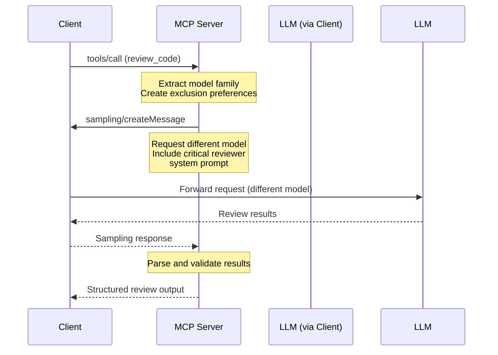

# MCP Code Crosscheck

An MCP (Model Context Protocol) server that provides bias-resistant AI code review by requesting sampling from the client with carefully crafted review prompts, ensuring cross-model evaluation.

## Overview

This server addresses the hypothesis that as more code is being generated AND evaluated by the same model, the risk of bias towards that model's preferences will grow, leading to blind spots in code quality and lower diversity of approaches/implementations over time.

The solution: **Cross-Model Code Review** - ensuring that code generated by one model is reviewed by a different model to minimize bias and improve review quality.

## Features

### 🔧 Tools

- **`review_code`**: Orchestrates bias-resistant code review by requesting sampling from the client with a different model than the one that generated the code

### 📚 Resources

- **Review Templates**: System prompts for different review types:
  - `review://templates/security` - Security-focused reviews
  - `review://templates/performance` - Performance-focused reviews  
  - `review://templates/maintainability` - Maintainability-focused reviews
  - `review://templates/general` - General code reviews

### 💬 Prompts

- **`quick_security_review`**: Manual security review prompt
- **`performance_review`**: Manual performance review prompt
- **`maintainability_review`**: Manual maintainability review prompt

## How It Works

1. **Model Exclusion**: The server tracks which model generated the code and ensures a different model family is used for review
2. **Client Sampling**: Uses MCP's sampling feature to request the client use a different model
3. **Structured Output**: Returns consistent review format with severity levels, metrics, and alternatives
4. **Flexible Model Selection**: Uses metadata and hints to guide client model choice without hardcoding specific models

## Installation

```bash
# Clone the repository
git clone <repository-url>
cd mcp-code-crosscheck

# Install dependencies
npm install

# Build the project
npm run build
```

## Usage

### As an MCP Server

Add to your MCP client configuration:

```json
{
  "mcpServers": {
    "code-crosscheck": {
      "command": "node",
      "args": ["path/to/mcp-code-crosscheck/dist/index.js"],
      "env": {}
    }
  }
}
```

### Tool Usage

#### Review Code Tool

```javascript
// Example tool call
{
  "method": "tools/call",
  "params": {
    "name": "review_code",
    "arguments": {
      "code": "def process_user_input(data):\n    return eval(data)",
      "generationModel": "gpt-4.1",
      "language": "python",
      "context": "User input processing function"
    }
  }
}
```

**Input Parameters:**
- `code` (required): The code to review
- `generationModel` (required): Model that generated the code
- `language` (optional): Programming language
- `context` (optional): Additional context about the code

**Output:**
- `reviewModel`: Model used for review
- `summary`: Brief overall assessment
- `issues`: Array of identified issues with severity and suggestions
- `metrics`: Quantitative ratings (1-5) for error handling, performance, security, maintainability
- `alternative`: Alternative implementation approach

### Prompt Usage

Use the provided prompts for manual code reviews:

```javascript
// Quick security review
{
  "method": "prompts/get",
  "params": {
    "name": "quick_security_review",
    "arguments": {
      "code": "your code here"
    }
  }
}
```

## Model Selection Strategy

The server implements a flexible model exclusion strategy:

1. **Family Extraction**: Extracts model families (e.g., "gpt-4-turbo" → "gpt-4")
2. **Exclusion Logic**: Avoids same model and same family for reviews
3. **Client Guidance**: Provides metadata and hints to help clients select appropriate alternative models
4. **Fallback Support**: Works with clients that don't support advanced model selection

### Supported Model Families

- GPT family
- Claude family
- Gemini family
- And others...

## Architecture



## Development

### Scripts

- `npm run build` - Compile TypeScript
- `npm run dev` - Watch mode compilation
- `npm start` - Run the server

### Project Structure

```
src/
├── index.ts          # Main entry point (STDIO transport)
├── server.ts         # Core MCP server implementation
├── types.ts          # TypeScript type definitions
└── utils.ts          # Utility functions for model selection and prompts
```

## Examples

### Security Review Example

```python
# Input code
def authenticate_user(username, password):
    query = f"SELECT * FROM users WHERE username='{username}' AND password='{password}'"
    return db.execute(query)
```

**Review Output:**
- **Critical Issue**: SQL injection vulnerability
- **Major Issue**: Plain text password comparison
- **Suggestion**: Use parameterized queries and password hashing
- **Alternative**: Use ORM with proper authentication library

### Performance Review Example

```javascript
// Input code
function findUser(users, targetId) {
    for (let i = 0; i < users.length; i++) {
        if (users[i].id === targetId) {
            return users[i];
        }
    }
    return null;
}
```

**Review Output:**
- **Minor Issue**: Linear search inefficiency for large datasets
- **Suggestion**: Use Map or Set for O(1) lookups
- **Alternative**: `users.find(user => user.id === targetId)`

## Related

- [Model Context Protocol](https://modelcontextprotocol.io/)
- [MCP TypeScript SDK](https://github.com/modelcontextprotocol/typescript-sdk)
